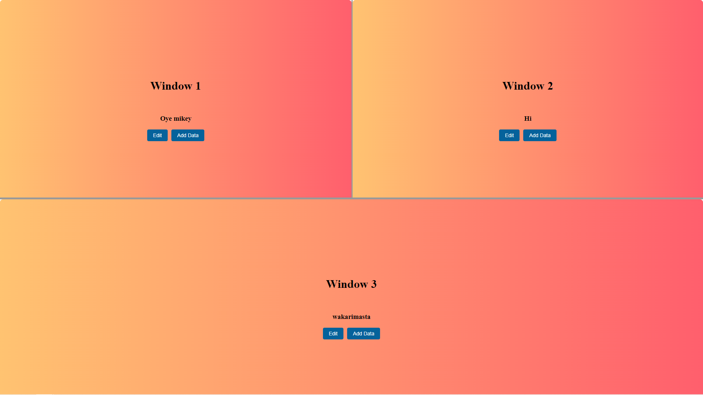

### Client Details
Deployment URL : <a href="https://dataneuron-assignment.vercel.app/" target="_blank">Link</a>
<h5>A responsive resizable three panel layout which can interact with the server api to: </h5>
1. AddData
2. UpdateData in the db



### API Details
<h5>This api allows clients to interact with it and perform the following operations:</h5> </br>
1. AddData 
2. UpdateData
3. GetCount 

#### The deployment url
<a href="https://dataneuron-assignment-jvlm.onrender.com/api/v1/healthcheck" target="_blank"> Check Server health</a> </br>
<a href="https://dataneuron-assignment-jvlm.onrender.com/api/v1/component/getCount" target="_blank">https://dataneuron-assignment-jvlm.onrender.com/api/v1/component/getCount</a>

#### Endpoints
1. ```GET /api/v1/healthcheck           Get the health of server ```
2. ```POST /api/v1/component/addData    Add a new component ```
4. ```PATCH /api/v1/component/updateData   Update data component ```
5. ```GET /api/v1/component/getCount    Get the count of add and update actions. ```

   
#### API Execution Time


#### Features
1. Emphasis on separation of concern by adhering to a strict architectural pattern.
2. Custom APIerror and APIresponse.
3. Validation on data.
4. Clean Code.

#### Tools 
<ul>
  <li>Node js</li>
  <li>Express js</li>
  <li>Mongodb</li>
  <li>Render</li>
</ul>

